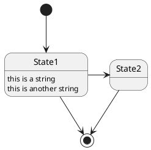
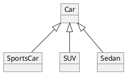

Plantuml is a UML generator from text.
They provides vaious type of UML. To check full documentation, see [the official Plantuml site](http://plantuml.com/).


## plantuml-markdown
[plantuml-markdown](https://github.com/mikitex70/plantuml-markdown) is a Python-Markdown plugin. This plugin supports 2 types of syntax, but in here we recoomend to use markdown style syntax for more natural markdown.

This plugin also provides an useful feature to set arguments for `image` tag like class, width, height etc. See samples below.

## Sample Diagrams
Here are some basic UML Diagram examples.

### Sequence Diagram
    ```plantuml format="png" classes="uml myDiagram" alt="My super diagram placeholder" title="My super diagram" width="300px" height="300px"
      Goofy ->  MickeyMouse: calls
      Goofy <-- MickeyMouse: responds
    ```

```plantuml format="png" classes="uml myDiagram" alt="My super diagram placeholder" title="My super diagram" width="300px" height="300px"
  Goofy ->  MickeyMouse: calls
  Goofy <-- MickeyMouse: responds
```

### State Diagram
    ```plantuml format="png" width="20%"
    @startuml
    [*] --> State1
    State1 --> [*]
    State1 : this is a string
    State1 : this is another string
    State1 -> State2
    State2 --> [*]
    @enduml
    ```



### Object Diagram (Class Diagram)
    ```plantuml
    @startuml
    object Car
    object SportsCar
    object SUV
    object Sedan

    Car <|-- SportsCar
    Car <|-- SUV
    Car <|-- Sedan
    @enduml
    ```


